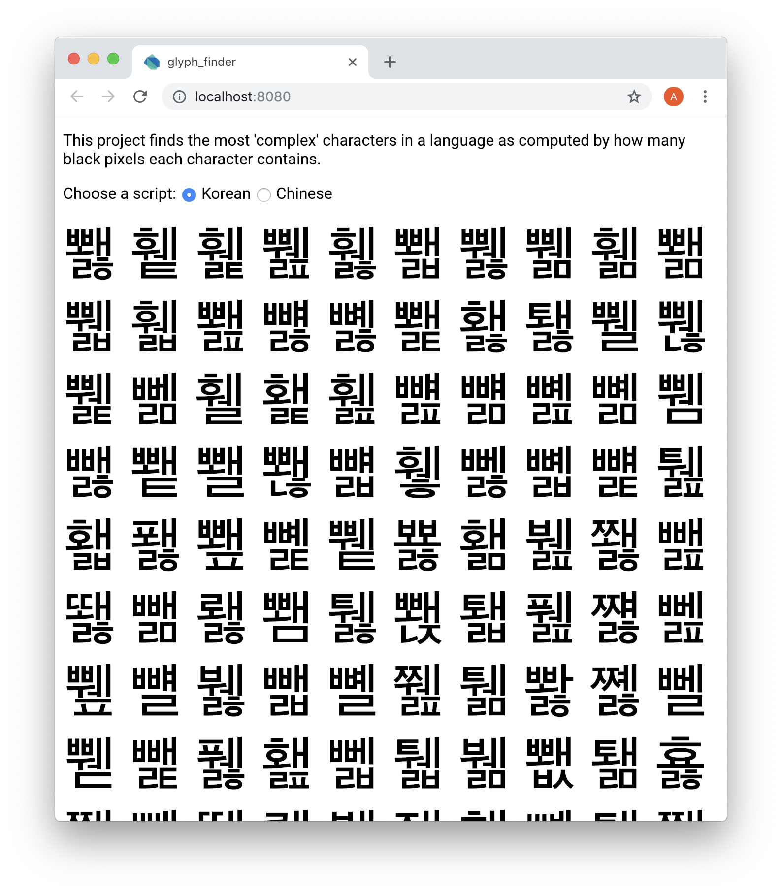

# glyph_finder

A project to find the most complex characters in a few languages.



## Running

After getting dependencies with `pub get`, run:

```
webdev serve
```

Created from templates made available by Stagehand under a BSD-style
[license](https://github.com/dart-lang/stagehand/blob/master/LICENSE).
