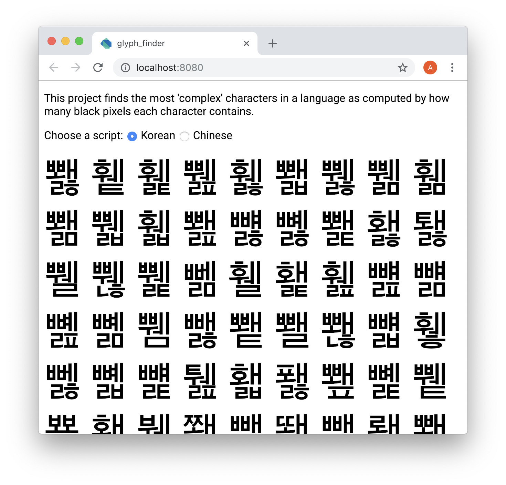
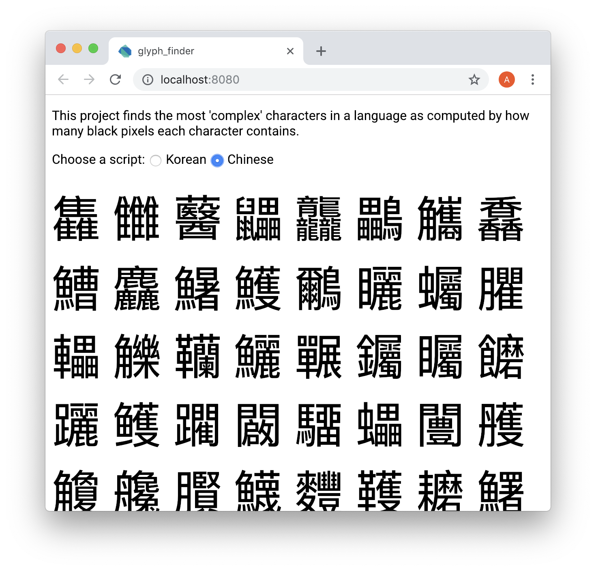

# glyph_finder

A project to find the most complex characters in a few languages.

## Results

### Korean

Here are the first 15: 뾇 휕 휉 쀒 휋 뾃 쀓 쀎 휆 뾂 쀏 휇 뾆 뻃 뼳.



### Chinese

Here are the first 15: 雥 雦 鿀 鼺 龘 鸓 觿 馫 鰽 麤 鱪 鱯 鸍 矖 蠾.



## Running

After getting dependencies with `pub get`, run:

```
webdev serve
```

Created from templates made available by Stagehand under a BSD-style
[license](https://github.com/dart-lang/stagehand/blob/master/LICENSE).
